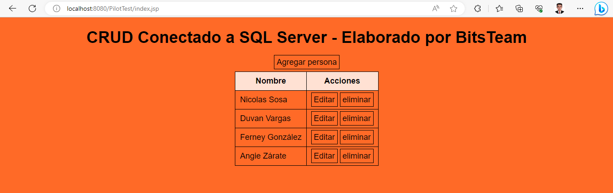
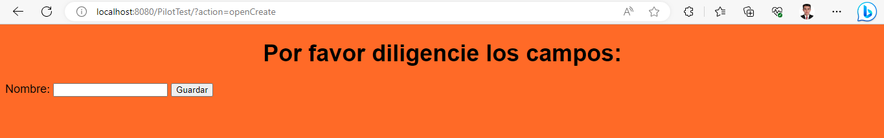
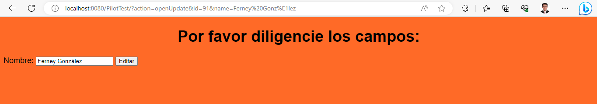

# PilotTest
Este proyecto es un simple CRUD, fue diseñado con el patrón de diseño MVC, y está elaborado con las siguientes
tecnologías:

<ul>
    <li>NetBeans 16</li>
    <li>Maven</li>
    <li>GlassFish 5.0.1</li>
    <li>Java SE 8</li>
    <li>Java EE 8 (Servlets y JSPs)</li>
    <li>Microsoft SQL Server</li>
    <li>CSS</li>
</ul>

Para implementar esta solución en su equipo, tenga en cuenta lo siguiente:

<ul>
    <li>Utilice un IDE como NetBeans, sin embargo, es posible realizarlo en cualquier otro.</li>
    <li>Su servidor debe contar con la biblioteca que le permita conectarse a la base de datos SQL Server. El conector
        se encuentra en el directorio raíz de este repositorio “mssql-jdbc-12.2.0.jre8”:</li>
    <ul>
        <li>En el caso de GlassFish 5.0.1 deberá ubicarse en la ruta “glassfish5\glassfish\lib\” donde se encuentra
            ubicado su servidor y copiar ahí el conector mencionado anteriormente.</li>
    </ul>
    <li>En el directorio raíz también encontrará una base de datos llamada “PilotTestDB.sql”, deberá importarla dentro
        de su servidor de base de datos Microsoft SQL Server.</li>
    <li>En el código fuente del proyecto, es necesario que configure las variables USER, PASSWORD y URL ubicadas en la
        clase “PilotTest\src\main\java\model\ ConnectionDB.java”, conforme a las configuraciones y credenciales de su
        base de datos SQL Server.</li>
</ul>

<h2>Capturas de pantalla:</h2>

